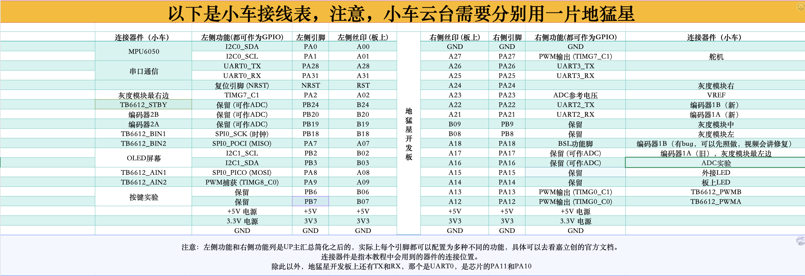
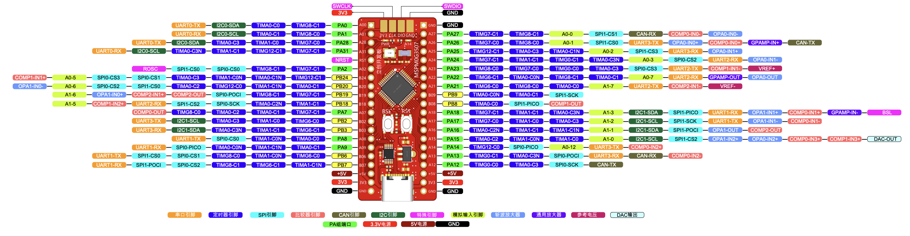
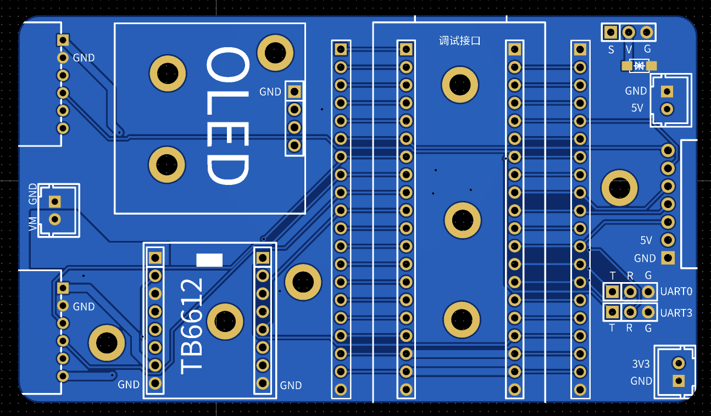
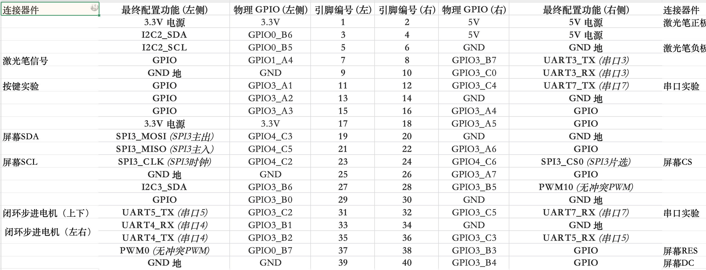
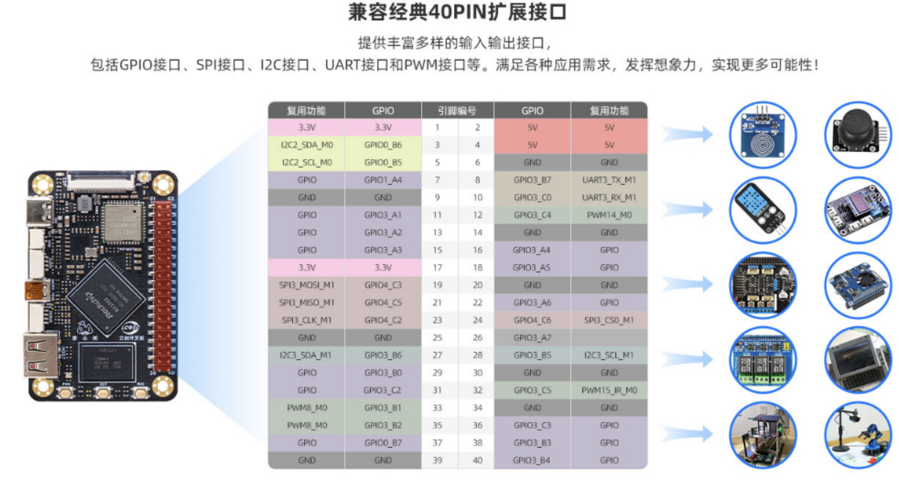

# 电赛指北

> 立创·地猛星 MSPM0G3507 + 泰山派 RK3566 双芯架构，从硬件接线到 AI 部署的完整竞赛指南。

---

## 重要前提

1. 无论出现什么问题，**先排查外部原因**。包括但不限于：鞋印子、电池没电、没开开关、接线松了、线接反了、电脑死机、做梦了、喝多了、板子成精了、穿越了等等。排完外部原因再看硬件——接线错误、焊接问题、TB6612 发财。以上都确认没问题再改代码。**万不得已不要动代码，能跑就不动。**
2. 有问题找 AI，AI 不会说明没问题。
3. 记得共地。
4. 快递记得发顺丰。

---

## 一、接线

### 1. 地猛星接线表

新模块没有接线表，见下方原理图。





### 2. 拓展板接线



| 位置 | 用途 |
|------|------|
| 左侧（对称两个） | 电机 |
| 左侧中间 | 电源模块，7.4V 输入 |
| 中间偏右 | OLED 屏、TB6612、地猛星 |
| 右上 | 舵机 |
| 下方两个 UART | UART3 接陀螺仪，0 未定 |
| 再往右 | 两个板子供电输入、接灰度模块 |

具体针脚见小车底板 EDA 文件。没有接口的直接接地猛星旁边的两排排母。不够的话——没人规定只能用一块地猛星。

### 3. 泰山派接线





---

## 二、模块阐述

### 1. 地猛星

- 开发板，基于 TI M0G3507
- 针脚配置见接线部分
- 性能一般，代码封装好跑 AI
- 串口调试用 AI，VS Code 是好东西
- **接线紧张时接口优先级**：UART（串口）> PWM > I2C = 串行 > GPIO
- 购买：https://item.szlcsc.com/24478333.html

#### 进入低功耗模式（锁芯片）

1. 打开 https://wiki.lckfb.com/storage/html/mspm0-web-flasher/index.html
2. Type-C 线连接地猛星和电脑
3. 点击"连接串口"，选择带 USB 的设备，固件选"地猛星"
4. 按住 BSL → 按住 RST（BSL 不松）→ 松开 RST → 松开 BSL → 10 秒内点"一键烧录"

#### 烧坏了

> 先确认是烧坏了，不是接错线了！

把芯片焊下来，焊另一片上去。

---

### 2. 拓展板

见接线部分。

---

### 3. 电机驱动

#### TB6612

- 输入电压 7.4V 最佳
- 额定/峰值输出电流很小（峰值 1.2A）
- 大电机堵转 → 电流倒灌 → 超过峰值 → 烧毁
- 适合 **310 电机**（堵转 1.5A）

#### AT8236

- 输入电压可达 12V
- 峰值输出电流 6A
- 可带动 **513 电机**（堵转 3.2A）
- 公对母杜邦线接到原 TB6612 排母

---

### 4. 电机

| 型号 | 输入电压 | 堵转电流 | 减速比 | 特点 |
|------|----------|----------|--------|------|
| 310 | 7.4V | 1.5A | 1:20 | 小尺寸，动力拉胯，基本不会烧 TB6612 |
| 513 | 12V | 3.2A | 1:30 | 尺寸大，动力强，需要好驱动模块 |

---

### 5. 陀螺仪

#### 汇电籽 601

- 本质：ICM42688 + 一块 M0G3507
- 体感没那么神（可能因为没用过差的）
- 串口输出

#### MPU6500/6050

- 便宜，但容易掉
- I2C 输出

---

### 6. 舵机

- 型号：MR996R
- 用途：四轮舵机转向小车
- PWM 输出

---

### 7. 灰度模块

#### 敢为八路

- 辅助板接四根线（串行输出）或十根线（GPIO 输出）
- 不用辅助板应该也不难

#### 五路

- 不好用

---

### 8. 云台

清单没有，不管。

---

### 9. 泰山派

视觉模块，支持 OpenCV（传统视觉）和 YOLO（AI 视觉）。

#### OpenCV

1. 打开 WinSCP 连接泰山派。连不上？继续往下看：
2. 打开 `电赛视觉资料/01_RX.../bin` 文件夹
3. 空白处右键 → 在终端中打开
4. `.\adb.exe shell`
5. `cd` → 回车
6. `bash connect_wifi.sh wifi名 wifi密码`
   - wifi 名**只能是一个英文单词**
   - wifi 必须是 **2.4G**
7. 连接成功后会显示 IP，选中 → 右键复制
8. 回到 WinSCP 输入 IP 连接
9. 能连上后，VS Code SSH 插件连接泰山派即可

#### YOLO

需在 Ubuntu 虚拟机中将 .pt 文件转为 .rknn 文件。具体步骤自行搜索。

---

## 三、YOLO 训练

### 1. 框图

1. `Win + R` → 输入 `cmd` → 回车
2. `conda activate labeling` → 回车
3. `labeling` → 回车
4. 在打开窗口中：按住 **W**，鼠标拖选目标对象
5. 输入对象名，点 Save → Next Image
6. 重复。本次竞赛识别钢球，命名为 `gangqiu`

### 2. 训练

1. VS Code → 打开文件夹 → 找到下载里的 yolo 文件夹 → 选中（不要双击点进去）
2. 点击 `data_split.py` → 右上角三角形运行
3. 运行完毕后，点击 `train.py`，设置 `epochs=`（训练轮数）
4. 右上角三角形开始训练

---

## 四、AI

### 1. Agent 选择

- VS Code 中使用 Claude Code 插件
- 桌面端 Claude Code / Codex
- 终端中使用 Grok Build / Cursor

### 2. 部署 API

先打开桌面上的 **CC Switch**，确保本地代理已开。

| 供应商 | 操作 |
|--------|------|
| Deepseek / GLM / Kimi 等国内 | 开 CC Switch，最小化即可 |
| Claude 全家桶 / ChatGPT / Grok / 哈基米 | 开梯子（Clash Verge 等）+ CC Switch |

### 3. Skill

- 库中附有 **MSPM0G3507 Skill**，包含上述硬件模块的使用方式和例程
- 库中附有 **电赛报告 Skill**，告诉 AI 你的题目和与上述不同的/额外的模块即可

---

## 仓库内容

```
├── README.md                       # 你现在看的东西（电赛指北全文）
├── guide/                          # 图片等资源
├── mspm0g-contest/                 # Claude Code Skill：MSPM0G 开发助手
│   ├── SKILL.md                    # 外设驱动、引脚映射、PID、灰度、泰山派等
│   ├── pins.md / pwm.md / adc.md   # 各外设参考
│   ├── templates/ / examples/      # 模板与示例
│   └── references/                 # 泰山派参考文档
└── 电赛报告/                        # Claude Code Skill：电赛技术报告写作
    ├── SKILL.md
    ├── scripts/md_to_docx.py       # MD 转 Word 脚本
    └── templates/report_outline.md # 报告大纲模板
```

## 快速开始

```bash
git clone https://github.com/Sarp-Relieve/diansai-guide.git
cp -r diansai-guide/mspm0g-contest ~/.claude/skills/
cp -r diansai-guide/电赛报告 ~/.claude/skills/
```

重启 Claude Code 后生效：写代码自动调用 MSPM0G Skill，写报告时说"写电赛报告"触发报告 Skill。

---

## 硬件平台

| 模块 | 型号 | 备注 |
|------|------|------|
| 主控 | 立创·地猛星 MSPM0G3507 | 双板架构（小车+云台各一片） |
| 视觉 | 泰山派 RK3566 | OpenCV / YOLO |
| 电机驱动 | TB6612 / AT8236 | 310 / 513 电机 |
| 陀螺仪 | 汇电籽 601（ICM42688）/ MPU6500 | 串口 / I2C |
| 灰度 | 敢为八路 | 串行 / GPIO |
| 舵机 | MR996R | PWM |

---

## 相关链接

- [Granary GIM](https://www.granarygim.com) — 提供大部分模块的硬件和资料
- [地猛星购买](https://item.szlcsc.com/24478333.html)
- [MSPM0 烧录工具](https://wiki.lckfb.com/storage/html/mspm0-web-flasher/index.html)
- [学不会电磁场](https://space.bilibili.com/568468320)
- [我嘞个驾驶学院](https://space.bilibili.com/357664075)
- [地猛星引脚图](guide/地猛星引脚图.pdf)
- [泰山派原理图](guide/泰山派原理图.pdf)
- [小车底板 EDA](guide/小车底板.epro2)
- [多开关板 EDA](guide/多开关板.epro2)
- [拓展板原理图 1](guide/拓展板原理图.pdf) / [拓展板原理图 2](guide/拓展板.pdf)
- [按钮原理图 1](guide/按钮原理图.pdf) / [按钮原理图 2](guide/按钮.pdf)
- [八路灰度传感器手册](guide/八路灰度传感器手册.pdf)
- [汇电籽 601 模块说明](guide/汇电籽601模块说明.pdf) / [汇电籽 601 通信协议](guide/汇电籽601通信协议.pdf)
- [电磁铁产品手册](guide/电磁铁产品手册.pdf)
- [2026 浙江赛区注意事项](guide/2026浙江赛区注意事项.pdf)

---

## 致谢

**感谢我的队友——王钰婷、孔熙月。** 一起折腾这场"全国大学生网购与熬夜大赛"，我们各有所长、互相兜底，缺了谁都不完整。

**感谢朱虹老师**慧眼识"猪"，给了我这个机会。

**感谢 B 站 UP 主 学不会电磁场**提供的硬件清单与教程。

**感谢 B 站 UP 主 我嘞个驾驶学院**提供的 Skill 基础模板。

**感谢 AI：Claude Code、DeepSeek、Grok、ChatGPT**，这是 AI 的时代。

**感谢厦门、集美、集美大学**，我活得挺好。

**感谢钟臻林、杨鑫美、费兆悦、叶信妤、李柯昊、毛子恺**等朋友，陪我聊聊天、听我扯皮，让我在焦头烂额的日子里还能开心一下。有你们这样的朋友，是我的运气。

**特别感谢我的爸妈**，虽然啥也不懂，但也一直毫无保留地支持着我。你们不懂我在做什么，但你们从来都相信我在做对的事，这份信任比什么都珍贵。

**特别感谢我的大胖弟弟**，一直想念着我。我也是。

---

## 写在最后

生活真美好，天天开心啊。
